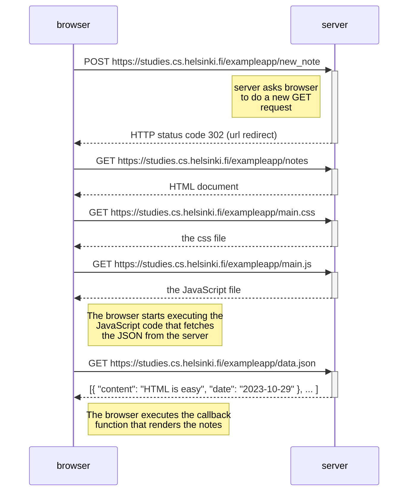

```mermaid

sequenceDiagram
    participant browser
    participant server
 browser->>+server: POST https://studies.cs.helsinki.fi/exampleapp/new_note

    Note left of server: server asks browser<br/>to do a new GET<br>request
    server-->>-browser: HTTP status code 302 (url redirect)

    browser->>+server: GET https://studies.cs.helsinki.fi/exampleapp/notes
    server-->>-browser: HTML document

    browser->>+server: GET https://studies.cs.helsinki.fi/exampleapp/main.css
    server-->>-browser: the css file

    browser->>+server: GET https://studies.cs.helsinki.fi/exampleapp/main.js
    server-->>-browser: the JavaScript file

    Note right of browser: The browser starts executing the<br> JavaScript code that fetches<br> the JSON from the server

    browser->>+server: GET https://studies.cs.helsinki.fi/exampleapp/data.json
    server-->>-browser: [{ "content": "HTML is easy", "date": "2023-10-29" }, ... ]

    Note right of browser: The browser executes the callback<br> function that renders the notes
```
