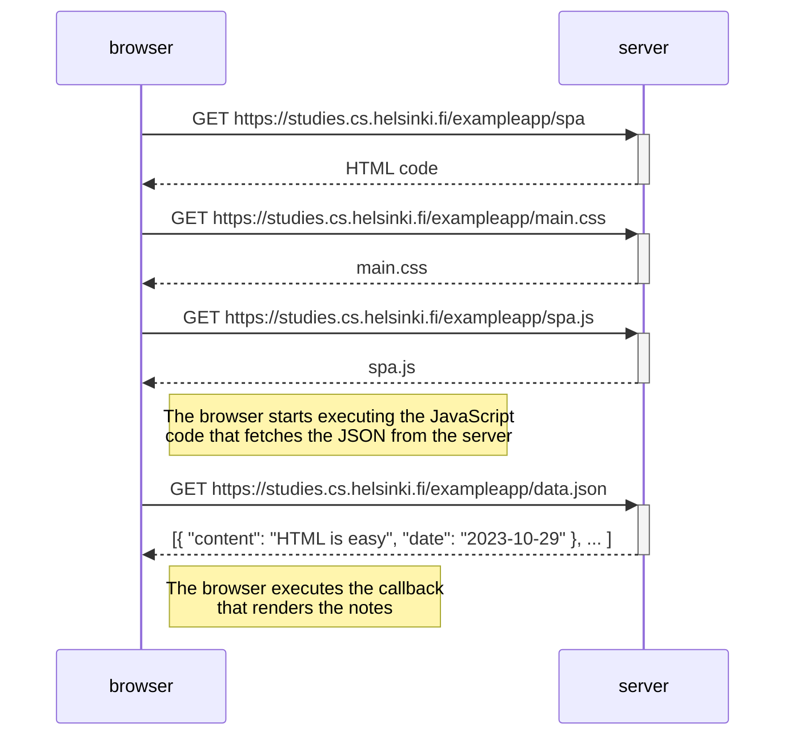

```mermaid
sequenceDiagram
    participant browser
    participant server

    browser->>+server: GET  https://studies.cs.helsinki.fi/exampleapp/spa
    server-->>-browser: HTML code

    browser->>+server: GET https://studies.cs.helsinki.fi/exampleapp/main.css
    server-->>-browser: main.css

    browser->>+server: GET https://studies.cs.helsinki.fi/exampleapp/spa.js
    server-->>-browser: spa.js

    Note right of browser: The browser starts executing the JavaScript<br> code that fetches the JSON from the server

    browser->>+server: GET https://studies.cs.helsinki.fi/exampleapp/data.json
    server-->>-browser: [{ "content": "HTML is easy", "date": "2023-10-29" }, ... ]

    Note right of browser: The browser executes the callback<br> that renders the notes


```
